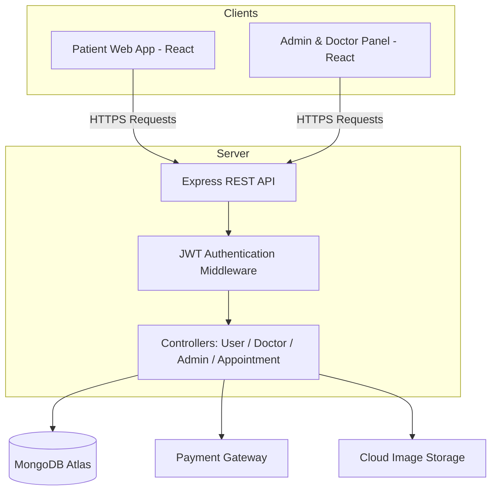
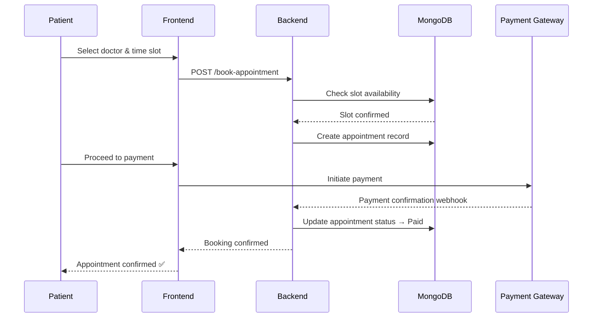

# 🩺 Prescripto — Full-Stack Doctor Appointment Booking Platform

A production-style, full-stack healthcare appointment booking platform built on the **MERN stack** (MongoDB, Express, React, Node.js). Prescripto connects patients with doctors through a seamless booking experience — complete with three-tier authentication, real-time appointment management, integrated online payments, and dedicated dashboards for every role.


**🔗 Live Demo:** [prescripto.vercel.app](https://prescripto-2-oaxz.onrender.com/)

---

## 📖 About The Project

Booking a doctor's appointment shouldn't mean phone calls, waiting rooms, or paperwork. **Prescripto** digitizes the entire process end-to-end — patients discover doctors and book instantly, doctors manage their schedule and earnings from a live dashboard, and admins run the platform from a centralized control panel.

This isn't a single-user CRUD app — it's a **multi-tenant system with three independent authentication flows**, real-time appointment state syncing across dashboards, and a live payment gateway integration, making it representative of how real healthcare-tech platforms are architected.

### Why this project stands out

- 🔐 **Three isolated auth systems** (Patient / Doctor / Admin) — not just role flags on one user table
- 💳 **Real online payment integration**, not a mocked checkout
- 📊 **Three separate applications** in one repo (patient site, admin/doctor panel, backend API) — a genuine monorepo-style full-stack architecture
- 🔄 **Live state sync** — a booked/cancelled appointment reflects instantly across patient, doctor, and admin views
- 📱 Fully responsive, deployed, and publicly demoable — not just running on `localhost`

---

## ✨ Feature Breakdown

### 👤 Patient Portal
- Register and log in securely
- Browse doctors filtered by specialty
- View doctor profiles — experience, fees, availability
- Book appointments in real time with slot selection
- Pay consultation fees online through integrated payment gateway
- View, track, and cancel booked appointments
- Manage and update personal profile

### 🩺 Doctor Dashboard
- Secure doctor-only login
- View all incoming and upcoming appointments
- Mark appointments as completed or cancelled
- Track total earnings from consultations
- Update professional profile (fees, availability, bio)
- At-a-glance dashboard summary (appointments, earnings, patients)

### 🛡️ Admin Panel
- Secure admin authentication
- Add, edit, and manage doctor profiles across specialties
- View and manage **all** appointments platform-wide
- Monitor platform activity via a centralized dashboard
- Full oversight of patients, doctors, and bookings in one place

---

## 🛠️ Tech Stack

| Layer | Technology |
|---|---|
| **Frontend (Patient site)** | React JS, Tailwind CSS, React Router |
| **Frontend (Admin/Doctor panel)** | React JS, Tailwind CSS |
| **Backend** | Node.js, Express JS |
| **Database** | MongoDB with Mongoose ODM |
| **Authentication** | JWT-based token authentication |
| **Payments** | Integrated online payment gateway |
| **File/Image Handling** | Cloud-based image upload for doctor profiles |
| **Deployment** | Vercel (frontend + backend) |

---

## 🏗️ System Architecture



---

## 🔄 Appointment Booking Flow



---

## 🔐 Authentication & Authorization

Prescripto implements **three fully separate authentication contexts**, each with its own token scope and protected routes:

| Role | Access Scope | Protected Routes |
|---|---|---|
| **Patient** | Own profile, own appointments | `/api/user/*` |
| **Doctor** | Own appointments, own profile, earnings | `/api/doctor/*` |
| **Admin** | All doctors, all appointments, platform data | `/api/admin/*` |

- Passwords are hashed before storage
- JWT tokens issued on login and verified via middleware on every protected request
- Role-specific middleware ensures a patient token can never access doctor or admin routes, and vice versa

---

## 🌐 Core API Endpoints (Representative)

| Method | Endpoint | Description | Access |
|---|---|---|---|
| `POST` | `/api/user/register` | Register a new patient | Public |
| `POST` | `/api/user/login` | Patient login | Public |
| `GET` | `/api/doctor/list` | Fetch all doctors | Public |
| `POST` | `/api/user/book-appointment` | Book an appointment | Patient |
| `POST` | `/api/user/cancel-appointment` | Cancel an appointment | Patient |
| `POST` | `/api/user/payment` | Process appointment payment | Patient |
| `POST` | `/api/doctor/login` | Doctor login | Public |
| `GET` | `/api/doctor/appointments` | Get doctor's appointments | Doctor |
| `POST` | `/api/doctor/complete-appointment` | Mark appointment complete | Doctor |
| `POST` | `/api/admin/login` | Admin login | Public |
| `POST` | `/api/admin/add-doctor` | Add a new doctor | Admin |
| `GET` | `/api/admin/appointments` | View all appointments | Admin |

---

## 📁 Project Structure

```
prescripto/
│
├── frontend/                # Patient-facing React application
│   ├── src/
│   │   ├── components/
│   │   ├── pages/
│   │   ├── context/
│   │   └── assets/
│   └── package.json
│
├── admin/                   # Admin & Doctor dashboard (React)
│   ├── src/
│   │   ├── components/
│   │   ├── pages/
│   │   │   ├── Admin/
│   │   │   └── Doctor/
│   │   └── context/
│   └── package.json
│
├── backend/                 # Express REST API
│   ├── config/               # DB & cloud config
│   ├── controllers/          # Business logic per role
│   ├── middlewares/          # Auth & role verification
│   ├── models/                # Mongoose schemas
│   ├── routes/                 # API route definitions
│   └── server.js
│
└── README.md
```

---

## ⚙️ Getting Started

### Prerequisites
- Node.js (v16+)
- MongoDB instance (local or Atlas)
- Payment gateway API keys
- Cloud storage credentials (for doctor image uploads)

### Installation

```bash
# Clone the repository
git clone <your-repo-url>
cd prescripto

# Install dependencies for all three apps
cd backend && npm install
cd ../frontend && npm install
cd ../admin && npm install
```

### Environment Variables

Create a `.env` file inside `backend/`:

```env
MONGODB_URI=your_mongodb_connection_string
JWT_SECRET=your_jwt_secret
ADMIN_EMAIL=admin@example.com
ADMIN_PASSWORD=your_admin_password
CLOUDINARY_NAME=your_cloud_name
CLOUDINARY_API_KEY=your_api_key
CLOUDINARY_SECRET_KEY=your_secret_key
PAYMENT_GATEWAY_KEY=your_payment_key
PAYMENT_GATEWAY_SECRET=your_payment_secret
```

### Run Locally

```bash
# Start backend API
cd backend && npm run server

# Start patient-facing frontend
cd frontend && npm run dev

# Start admin & doctor panel
cd admin && npm run dev
```

---


---

## 🧪 Manual Testing Checklist

- [ ] Patient registration & login
- [ ] Doctor login
- [ ] Admin login
- [ ] Browse & filter doctors by specialty
- [ ] Book appointment with slot selection
- [ ] Online payment for appointment
- [ ] Cancel appointment (patient side)
- [ ] View & complete appointment (doctor side)
- [ ] Add new doctor (admin side)
- [ ] View all appointments (admin side)
- [ ] Profile update (patient & doctor)
- [ ] Responsive layout across mobile/tablet/desktop

---

## 🚀 Roadmap

- [ ] Email & SMS appointment reminders
- [ ] Video consultation integration
- [ ] Doctor ratings & patient reviews
- [ ] Prescription upload & history
- [ ] Multi-language support
- [ ] Analytics dashboard for admin (revenue trends, popular specialties)

---

## 💡 What This Project Demonstrates

- Designing and implementing **multi-role authentication** at scale
- Structuring a **real monorepo** with three independently deployable applications
- Building and consuming a **RESTful API** with protected, role-scoped routes
- Integrating **third-party services** — payments and cloud image storage — into a live application
- End-to-end **state management** across separate frontend applications sharing one backend
- Deploying a full-stack application to production (not just running locally)

---

## 👤 Author

**Sanjay Kumar**
B.Tech — Electrical Engineering
IIT (ISM) Dhanbad
